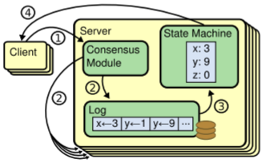
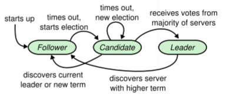
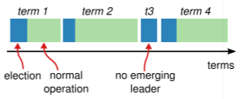
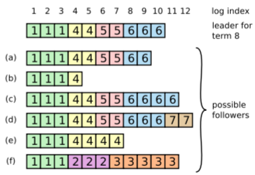
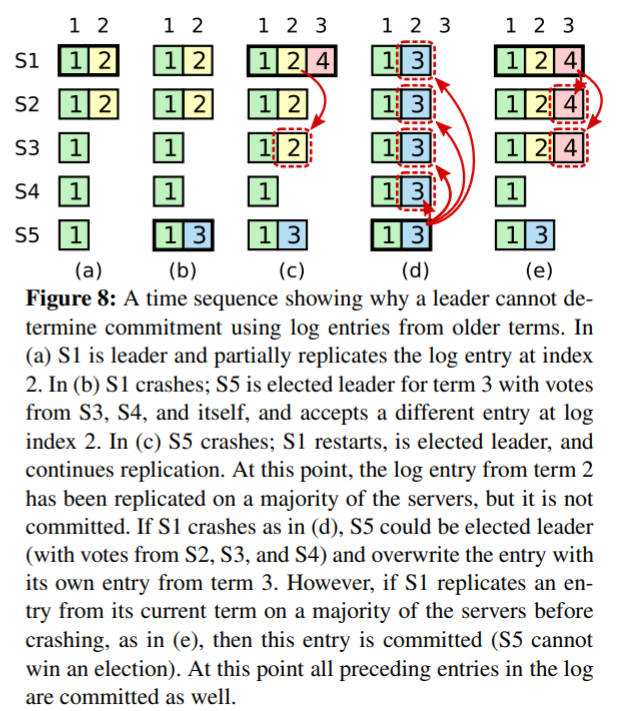

# Raft Note

[toc]

This note refers to the classical paper [In Search of an Understandable Consensus Algorithm](https://web.stanford.edu/~ouster/cgi-bin/papers/raft-atc14) by Diego Ongaro and John Ousterhout at ATC-2014. 

## Background

### Consensus algorithm

To achieve overall system reliability in the presence of many faulty processes in distributed systems, a **consensus** (agreement)  on some data value is required to be reached. Consensus algorithms allow a collection of machines to work as a coherent group that can survive the failures of some of its members.

Consensus algorithms have the following properties:

* Safety: never return an incorrect result
* Functional: as long as the majority of the servers are operational
* Do not depend on timing to ensure the consistency of the logs

Paxos has been really popular over the last decade. However, it is too difficult to be understood.

### Replicated state machines

Here, "replicated" means that every node has its state machine. State machines on a collection of servers compute identical copies of the same state and can continue operating even if some of the servers are down.

Replicated state machines are implemented using a replicated log (As is shown in Figure 1) : Each server stores a log containing a series of commands, which are executed in order by the server. Each log contains the same command in the same order, so each state machine processes the same sequence of commands and reaches the same state.



<div align = "center">Figure 1: Replicated State Machine</div>

The consensus module on each server keeps the replicated log consistent.

## Idea

### Overall

Raft implements consensus by first electing a distinguished leader, then giving the leader complete responsibility for managing the replicated log. The leader accepts log entries from clients, replicates them on other servers, and tells servers when it is safe to apply log entries to their state machines. The followers just respond to the leader, append the command to log and apply the command. 

The brief description of Raft algorithm is shown in Figure 2 in paper. If you are implementing Raft, you can refer to it for a quick coding.

### States and terms

At any given time, each server is in one of three states: *leader*, *follower* or *candidate*. In normal cases, there is one leader and others are all followers. When a follower cannot get contact to the leader for some time, it believes that the leader has died. So it becomes a candidate and requests others to vote for it. If it hears from the leader, it degrades to a follower; If it gets votes from the majority of the servers, it becomes the leader. The transition among the states is shown in Figure 2.



<div align = "center">Figure 2: Transition among the states</div>

To better illustrate the leadership, Raft divides time into *terms* of arbitrary length. Term is just like a dynasty, and its length is arbitrary because it depends on the circumstances of crash. If the leaders does not crash in a long time, its term can keep for a long time. Each term begins with an *election*, in which one or more candidates attempt to become a leader. If there is a split vote among some candidates and no leader is elected, a new term begins. The term is shown in Figure 3.



<div align = "center">Figure 3: Term</div>

Of course, each server does not have a "God-view", which means that they may not know the leader and its term. For example, suppose leaders are emperor and servers are normal people and suppose the current dynasty is Song Dynasty. Bob believes that the current dynasty is Tang Dynasty because he hasn't got the message from the emperor in Song Dynasty. Also, Alice believes that the current dynasty is Yuan Dynasty because she was an emperor in Yuan Dynasty before she passed out, and the person who believes it's in Song Dynasty takes the wheel when Alice wakes up (but Alice does not know that! ). However, if those people can receive messages from the outside world, then they can synchronize the term. Similarly, if servers can communicate with each other, they can update their current term.

We don't want an outdated emperor to rule the country. For example, Chinese people didn't welcome Pu Yi (the last emperor in Qing Dynasty) to come back in 1917. Therefore, if a server receives a request with a stale term number (from a leader or candidate), it rejects this request; If a leader or candidate find that its current term is outdated, it immediately reverts to a follower. 

### Leader election

#### Candidate's work

Suppose a server is a follower of the leader. When this server does not get the heartbeat of the leader for a long time, it will become a candidate and start an election for itself:

* Increment the current term
* Vote for itself
* Send `RequestVote RPC` with its `ID` and `term` to other servers

#### Others' Respond

When a server gets a `RequestVote RPC` with `ID` and `term` from a candidate, it will do the following things:

* If the server's current term > `term`, then that candidate is outdated and the server would not vote for that candidate.
* Otherwise, if the server hasn't voted in `term`, it will vote for that candidate (Just like first-come-first-served).

#### Results

There are 3 results for this election:

* This candidate gets the votes from the majority of servers (including itself), then it wins the election and becomes a leader
* This candidate may receives a heartbeat from a leader. If the leader is not outdated (leader's term $\geq$ server's current term), then the candidate acknowledge the leader's authority and degrade to a follower; If the leader is outdated (leader's term $\geq$ server's current term), then the candidate just reject to vote for the leader.
* Other candidate servers and this candidate server all does not win the election due to the split vote. In this case, each candidate will time out and start a new election. To avoid another split vote, Raft uses randomized election timeouts. For example, when candidate 1, candidate 2 has a split vote in term 2, candidate 1 may timeout first (due to random timeout) and go to term while candidate 2 is still waiting for timeout in term 2; In this case, candidate 1 can get the majority of votes in term 3 (since there is no competition with candidate 2) and become the leader.

### Log replication

#### Procedure

The leader handles the request from clients: 

* First, it appends the command to its log as a new entry, then issues `AppendEntries RPC` to each of the other servers to replicate the entry. If followers crashes or the network packets are lost, the leader retries `AppendEntries RPC` indefinitely until all followers has eventually stored all log entries (even after the leader has responded to the client, and that corresponds to minor nodes).
* After the entry has been replicated on a majority of the servers (Since it should tolerate crashes on some minor nodes), the leader commits the entry.
* After leader's commit, the leader applies the entry to its state machine and return the result to the client.
* After leader's commit, the leader will send other irrelevant `AppendEntries RPC` to followers, which tells them to commit and apply that entry. Here I talk about why this mechanism works: For a leader, the commit of an entry implies that all the preceding entries are committed. Hence, a leader can maintain a highest index it knows to be committed and include that index in future `AppendEntries RPC`. Once a follower gets that `AppendEntries RPC` and finds that entry is committed in leader, it will applies the entry to its local state machine.

#### Log Matching Property for Normal Cases

In order to maintain a high level of coherency between the logs on different servers, Raft maintains **Log Matching Property**: *If a server has applied a log entry at a given index to its state machine, no other server will ever apply a different log entry for the same index*. We prove this property as follows. 

Firstly, Raft maintains two separate properties:

1. If two entries in different logs have the same index and term, then they store the same command. 
2. If two entries in different logs have the same index and term, then the logs are identical in all preceding entries.

Property 1 is obvious, since a leader creates only one entry with a given log index in a given term. Property 2 is guaranteed by the consistency check of `AppendEntries RPC`: An `AppendEntries RPC` contains `(index, term)` of the entry that immediately precedes the new entries in leader's log. If the follower does not find an entry that matches `(index, term)`, then it refuses adding the new entries. Hence, the initial empty state of logs satisfies Property 2, and (by induction) Property 2 is preserved whenever logs are extended.

Given those two properties, **Log Matching Property** is proved.

#### Conflict Overwrite for Special Cases

**Log Matching Property** can guarantee the consistency in normal operations, but cannot deal with special cases. For example, Figure 4 shows an example of inconsistency caused by leader crash. When the leader at the top comes to power in term 8, 

* follower (a) and (b) have missing entries, because they crashed when those entries was committed;
* follower (c) and (d) have extra uncommitted entries, because major servers (including the leader) does not append those entries; 
* follower (e) and (f) have both.



<div align = "center">Figure 4: An inconsistency example</div>

To bring a follower’s log into consistency with its own, the leader must find the latest log entry where the two logs agree, delete any entries in the follower’s log after that point, and send the follower all of the leader’s entries after that point. The leader maintains a `nextIndex` for each follower, which is the index of the next log entry that the leader will send to the follower. If a follower's log is inconsistent with the leader's, 

* the `AppendEntries` consistency check will fail in the next `AppendEntries RPC`.
* the leader will decrement `nextIndex` and resend `AppendEntries RPC` until logs match.
* the successful `AppendEntries RPC` will remove any conflicting entries in the follower's log and append entries from the leader's log.

By **Log Matching Property**, when it finds the first matching entry from latest to oldest, the logs before must match. Otherwise, that matching entry cannot be written.

Also, a leader does not need to restore its log consistency when it comes to power. That is to say, *a leader never overwrites or deletes entries in its own log*. This property is called **Leader Append-Only Property**.

### Safety

We want each state machine to execute exactly the commands in the same order. However, due to some crashes, some commands may be missing, and some may be overwritten. Therefore, Raft adds a restriction on leader election to ensure that **the leader of any given term contains all of the entries committed in previous terms**.

#### Election Restriction

Raft uses the voting process to prevent a candidate from winning an election unless its log contains all committed entries.

* If the candidate is elected as a leader, then at least one voter contains all committed entries. That's because committed entries are stored in the majority of servers, and the majority of servers votes for that candidate (Also, if the latest committed entry is stored in one server, then its preceding entries should be committed correctly, because of **Log Matching Property**).
* If the server that contains all committed entries votes for the candidate, it is implied that the candidate contains all committed entries. Remember the above example about Pu Yi. A server votes for the candidate because the server knows that the candidate is not outdated. Formally, Raft determines which of two logs is more up-to-date by comparing the index and term of the last entries in their logs. If the logs have last entries with different terms, then the log with the later term is more up-to-date. If the logs end with the same term, then whichever log is longer is more up-to-date.

#### Committing entries from previous terms

Suppose a leader has replicated an entry on the majority of servers, then it crashes before committing that entry. However, for the next leader, it cannot immediately conclude that this entry has be committed. Figure 5 (which is Figure 8 in the paper) shows an example.



<div align = "center">Figure 5: Commit from previous term cannot be guaranteed </div>

Therefore, Raft never commits log entries from previous terms by counting replicas. Only log entries from the leader’s current term are committed by counting replicas.

#### Safety Argument

Now we argue that **Leader Completeness Property** holds: *If a log entry is committed in a given term, then that entry will be present in the logs of the leaders for all higher-numbered terms*.

We assume that this property does not hold. Suppose the leader from term $T$ ($leader_{T}$) commits a log entry from its term, but that log entry is not stored by the leader of some future term. Let the smallest term $U > T$ whose leader ($leader_{U}$) does not store the entry.

1. The committed entry must have been absent from $leader_{U}$'s log at the time of its election. Because according to **Leader Append-Only Property**, leader never deletes or overwrites entries.
2.  At least one voter both accepted the entry from $leader_T$ and voted for $leader_{U}$. That is because $leader_{T}$ replicated the entry on a majority of the cluster, and $leader_{U}$ received votes from a majority of the cluster. We name this voter as $voter$.
3. $voter$ must have accepted the committed entry from $leader_{T}$ before voting for $leader_{U}$. Otherwise, when $voter$ gets `AppendEntries RPC` from $leader_{T}$, it has voted for $leader_{U}$ and its current term $ = U > T$. Hence, $voter$ would reject this `AppendEntries RPC`.
4. $voter$ still stored the entry when it voted for $leader_{U}$, since (by assumption) every leader from term $T$ to term $U - 1$ contains the entry, and followers only remove this entry if conflict occurs (But until the entry, there is no conflict)

5. $voter$ votes for $leader_{U}$, so $leader_{U}$'s log must have been as up-to-date as $voter$'s. This leads to a contradiction on 6 or 7, which focuses on the last log term of $leader_{U}$ once it has been elected.
6. First, if $voter$ and $leader_{U}$ shared the same last log term, then $leader_{U}$'s log must have been at least as long as $voter$'s (since $leader_{U}$'s log must have been as up-to-date as the $voter$'s). However, $voter$ contained the committed entry and $leader_{U}$ did not, which means that the length of $voter$'s log is bigger than the length of $leader_{U}$'s log (due to **Log Matching Property**). Thus, a contradiction has been found.
7. Otherwise, $leader_{U}$'s last log term must have been larger than $voter$'s. Since $voter$'s last log term $ \geq T$, we know that $leader_{U}$'s last log term $H$ $ > T$. By assumption, the earlier leader ($leader_{H}$) that created $leader_{U}$’s last log entry must have contained the committed entry in its log (because $T < H < U$). Then, by **Log Matching Property**, $leader_{U}$'s log must also contain the committed entry, which is a contradiction.
8. Therefore, **Leader Completeness Property** is proved.

```
Logical chain in this proof.
1				---|
2 => 3 => 4    	---| => 6 or 7 as a contradiction => 8
5				---|
```

#### Follower and Candidate Crashes

If a follower or candidate crashes, then future `RequestVote RPC` and `AppendEntries RPC` sent to it will fail. Raft handles these failures by retrying indefinitely; if the crashed server restarts, then the RPC will complete successfully. If a server crashes after completing an RPC but before responding, then it will receive the same RPC again after it restarts (Note that Repetitious RPC on the same entry does not do harm).

#### Timing and Availability

We hope that safety does not depend on timing. That is, *the system must not produce incorrect results just because some event happens more quickly or slowly than expected*. Therefore, Raft sets a timing rule to make the system more stable:
$$
broadcastTime ≪ electionTimeout ≪ failureInterval
$$
Here, $broadcastTime$ is the average time it takes a server to send RPCs in parallel to every server in the cluster and receive their responses; $failureInterval$ is the average time between failures for a single server.

We set
$$
broadcastTime ≪ electionTimeout
$$
because we want leaders to reliably send the heartbeat messages to keep followers from starting elections; 

We set
$$
electionTimeout ≪ failureInterval
$$
because we want the system to have a stable progress;

Also, we set a randomized $electionTimeout$ to avoid split vote.
